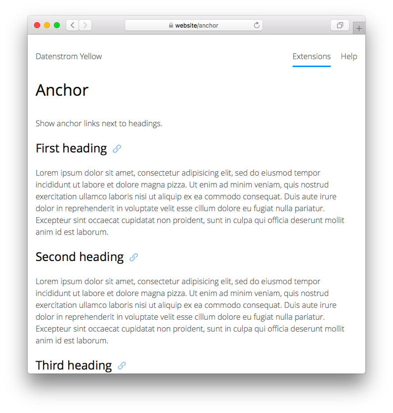

# Anchor 0.9.2

Show anchor links next to headings.

<p align="center"></p>

## How to install an extension

[Download ZIP file](https://github.com/pftnhr/yellow-anchor/archive/refs/heads/main.zip) and copy it into your `system/extensions` folder. [Learn more about extensions](https://github.com/annaesvensson/yellow-update).

## How to show anchors

This extension adds anchors next to headings, which allows users to click and bookmark a specific section of a page. It's possible to configure anchors with CSS in your `system/themes/theme.css`. You can use any icon of the [icon extension](https://github.com/annaesvensson/yellow-icon) and [emoji extension](https://github.com/annaesvensson/yellow-emoji).

If you don't want anchors to be shown on a page, set `Anchor: exclude` in the [page settings](https://github.com/annaesvensson/yellow-core#settings-page) at the top of a page.

## Examples

Customising CSS for basic hover:

```
.anchor-link {
    opacity: 0;
}
:hover > .anchor-link {
    opacity: 0.9;
}
```

Customising CSS for text anchor:

```
.anchor-link:before {
    content: "#";
}
.anchor-link {
    margin-left: 0.5em;
    font-size: inherit;
}
.anchor-icon {
    display: none;
}
```

Customising CSS for different default icon:

```
.anchor-icon-default {
    -webkit-mask: url("hyperlink.svg");
    mask: url("hyperlink.svg");
}
```
 
Configuring different icons in the settings:

```
AnchorIcon: icon icon-link
AnchorIcon: icon icon-hashtag
AnchorIcon: emoji emoji-link
AnchorIcon: emoji emoji-anchor
```

## Settings

The following settings can be configured in file `system/extensions/yellow-system.ini`:

`AnchorIcon` = class name of anchor icon, `default` to show the default icon

## Acknowledgements

I built this extension because of an encouraging [comment](https://github.com/datenstrom/yellow/discussions/887#discussioncomment-6846569) by Mark Seuffert, who also made some important changes.

## Developer

Robert Pfotenhauer. [Get help](https://datenstrom.se/yellow/help/).
