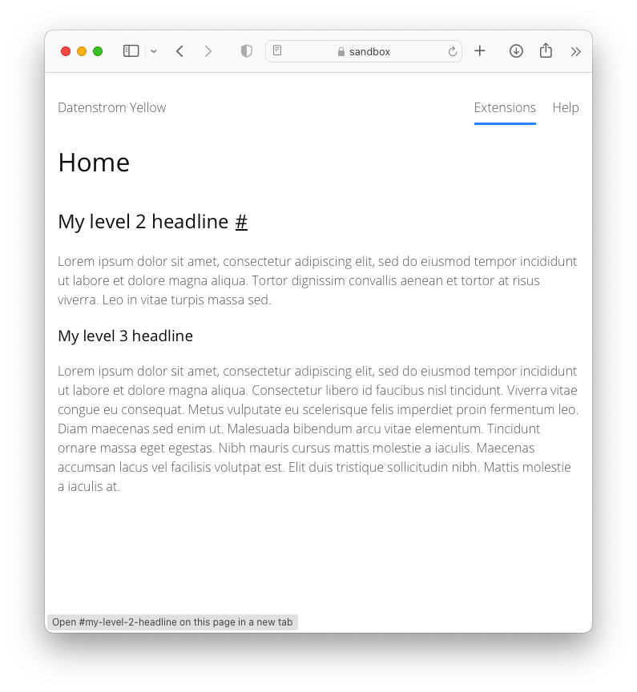

# Headinglink 0.8.21

Creates anchor links next to headings in the content.

## How to install an extension

[Download ZIP file](https://github.com/pftnhr/yellow-headinglink/archive/refs/heads/main.zip) and copy it into your `system/extensions` folder. [Learn more about extensions](https://github.com/annaesvensson/yellow-update).

## How to make anchor links next to the contents headline

Create a `[heading]` shortcut. 

## Examples

Making a headline with anchor link:

    [heading 2 "My level 2 headline"]
    [heading 3 "My level 3 headline"]

becomes

    <h2 id="my-level-2-headline" class="anchor-heading">My level 2 headline<a href="#my-level-2-headline" class="headinglink" aria-hidden="true" hidden>#</a></h2>
    <h3 id="my-level-3-headline" class="anchor-heading">My level 3 headline<a href="#my-level-3-headline" class="headinglink" aria-hidden="true" hidden>#</a></h3>

You can create headings for all 6 levels but keep in mind that a level 1 headline should only appear once per page.

## Settings

There are no settings. 

## Acknowledgements

I built this extension because of an encouraging comment by Mark Seuffert.

## Developer

Robert Pfotenhauer. [Get help](https://datenstrom.se/yellow/help/).
